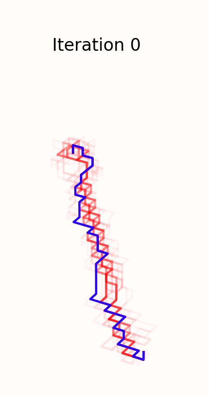

# Pipe Routing with IACO

🦺🚧 *This project is a work in progress.*

---

## Overview

This repo attempts to replicate the methodology and findings of the following paper, which lacks a public reference
implementation:
> Wu, L., Tian, X., Wang, H., Liu, Q. and Xiao, W. (2019), "Improved ant colony optimization algorithm and its
> application to solve pipe routing design", Assembly Automation, Vol. 39 No. 1, pp.
> 45-57. https://doi.org/10.1108/AA-02-2018-022

This paper offers multiple improvements to the
"vanilla" [Ant Colony Optimization](https://en.wikipedia.org/wiki/Ant_colony_optimization_algorithms) (ACO) algorithm to
enable its application to the routing of pipe paths in 3D space around obstacles. The authors' algorithm is named
_Improved Ant Colony Optimization_ (IACO). Three primary improvements are developed in the paper:

1. **Path evaluation:** the quantification of "desirability" of a pipe route
1. **Path mutation:** small, random changes to pipe routes akin to mutations in genetic algorithms
1. **Dynamic parameters:** some parameters are varied to better control exploration vs. exploitation

This repo implements the proposed algorithm and example applications supplied in the paper.



---

## How it works

Virtual ants wander through a 3D environment to discover the best possible path between the predetermined start and end
points of a pipe route. The quality of a route is measured by its fitness. Pheromones are deposited along the route of
each ant proportional its path fitness. Denser pheromones attract more ants, such that good routes gain more pheromones.
Pheromones slowly evaporate so that all routes will disappear over time unless reinforced. Because each ant navigates
probabilistically, the overall best path is optimized over many iterations by the ant population as small improvements
are randomly discovered.

In this paper, pipe route fitness depends on three characteristics:

1. Route length
2. Route evaluation (proximity to walls and obstacles)
3. Number of elbows (inflection points)

Ideally, each of these values is minimized. Therefore, a smaller raw fitness value signifies a better pipe route. An
exponential transformation converts this representation into a larger-is-better fitness scheme.

---

## Usage

```commandline
usage: pipe_router [-h] [-o OUTDIR] [-q] [-s SEED] [--show] [--loglevel LOGLEVEL] [--streamlog] yaml_path

positional arguments:
  yaml_path             Path to input file

options:
  -h, --help            show this help message and exit
  -o OUTDIR, --outdir OUTDIR
                        Path to output dir
  -q, --quiet           Quiet (no output)
  -s SEED, --seed SEED  Random seed
  --show                Show interactive plot (blocking call)
  --loglevel LOGLEVEL   Log level: [debug|info|warn]
  --streamlog           Mirror log stream to stdout

```

### Scenarios

A YAML configuration file defines a single "scenario", which includes obstacles, pipe route settings, and solver
details. A single scenario can define multiple pipe paths. A YAML schema is provided. The paper contains two pipe
routing applications (two
different scenarios):

- **Scenario 1**: the paper's Experiment; refer to Section 4 and Figure 11 in the paper.
- **Scenario 2**: the example practical application; refer to Section 5 and Figure 14 in the paper.

### Solvers

Three solvers are defined (refer to Section 4 in paper):

- `IACO` is the new solving algorithm introduced in the paper
- `ACS` (Ant Colony System) is a comparison benchmark
- `BACS` (ACS + dynamic parameters) is a comparison benchmark
